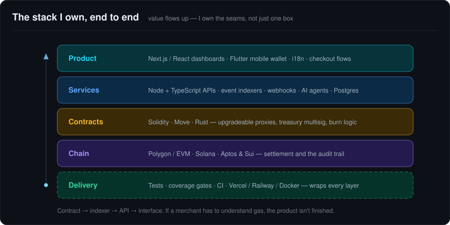

<h1 align="center">Christopher — Blockchain Engineer & Full-Stack Builder</h1>

  

  
  

  
  
  
  

---

## 👋 About

I build **on-chain systems end to end** — from the contract that holds the value, to the API that orchestrates it, to the interface a non-crypto user can navigate without ever hearing the word "wallet".

---

## 🏢 Where my work lives

  
  
  
  

Most of what I build ships under organisations rather than this personal account:

| Organisation | | Focus |
|---|---|---|
| **[Sermium](https://github.com/Sermium)** | my company · Brazil | Soroban treasury infrastructure, Sui tooling, RWA tokenization, EVM contracts |
| **[OC-Labs](https://github.com/OC-Labs)** | OnChainLabs · Switzerland | Wallet SDKs, NFC tooling, shared internal libraries |
| **[SM-Web-Systems](https://github.com/SM-Web-Systems)** | engineering education | Rust, Soroban, Stellar and Ethereum crash courses · LMS platform · robotics &amp; electronics |
| **[SettlX](https://github.com/SettlX-co)** | settlement company | Blockchain-based settlement for international trade — repositories still private |

> ⚠️ GitHub's built-in stat cards only count repositories owned by a **user account**, so they show none of the
> above. The Code footprint chart below is measured by **cloning every repository across my account and
> organisations** and counting the source lines I wrote — forks, generated output, lockfiles and vendored
> code excluded.

---

## 🧭 Specialities

  

  

---

## 🧱 The stack I own

  

---

## 🧪 Code footprint

  

---

## 🧰 Toolbelt

<b>⛓️ Smart contracts &amp; protocol</b>

 

Upgradeable proxies, treasury multisigs, deflationary burn mechanics, on-chain audit trails and token standards. Tests and coverage before mainnet, not after — custody and upgrade paths are designed per product, never copy-pasted.

<b>🔧 Backend &amp; APIs</b>

 

TypeScript monorepos, REST and webhook-driven services, payment rails, event indexers, background jobs and the glue that keeps off-chain state honest about on-chain state.

<b>🖥️ Frontend &amp; mobile</b>

 

Next.js dashboards, multilingual product sites, checkout flows, and Flutter apps with offline-first key handling — BIP39/BIP32 generation, challenge signing, balances and minting behind a UI that never says "gas".

<b>🚀 Infra, delivery &amp; AI automation</b>

 

Monorepo pipelines, CI with real coverage gates, deploys across Vercel and Railway — plus LLM agents wired into actual workflows with human-in-the-loop approval rather than autonomous posting.

---

## 💡 How I work

- **Contracts first, then everything around them.** Tests, coverage and upgrade paths before mainnet.
- **Custody is a design decision.** Key generation, storage and recovery get thought through per product.
- **Ship the whole thing.** Contract, indexer, API, dashboard, mobile app, deploy pipeline.
- **Boring UX for exotic tech.** If a merchant needs to understand gas, the product isn't finished.

---

## 📈 Activity

  

  

  

---

## 📬 Get in touch

- 🌐 [sermiumglobal.com](https://sermiumglobal.com) · [onchainlabs.ch](https://onchainlabs.ch)
- 💼 [linkedin.com/in/christopherfourquier](https://www.linkedin.com/in/christopherfourquier)
- ✉️ christopher.fourquier@onchainlabs.ch
- 💬 Open to protocol work, smart-contract development and audits, tokenization projects, and full-stack builds.

Building on-chain infrastructure that people use without knowing it's on-chain.

