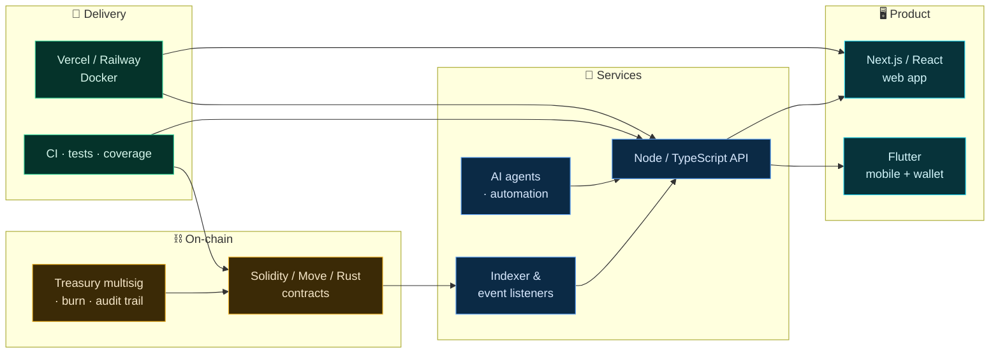
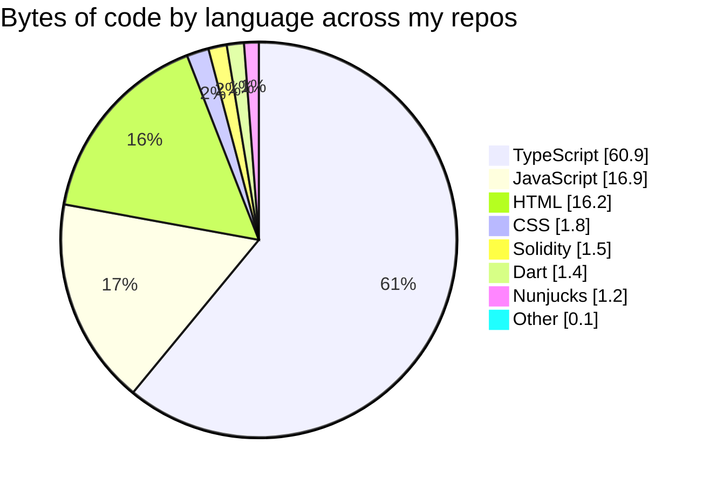

<h1 align="center">Christopher — Blockchain Engineer & Full-Stack Builder</h1>

  <em>Smart contracts on EVM, Move and Rust chains — wrapped in products people can actually use.</em>

  
  
  

---

## 👋 About

I build **on-chain systems end to end** — from the contract that holds the value, to the API that orchestrates it, to the interface a non-crypto user can navigate without ever hearing the word "wallet".

---

## 🧭 Specialities

  

  

---

## 🧱 How a project fits together

The layers I work across on a typical build — I own the seams, not just one box.

---

## 🧪 What I actually ship in

Aggregated from the source in my public repositories:

> Contract code is small by volume and large by consequence — a 200-line vault carries more risk than 20k lines of UI.

---

## 🔍 Deep dive

<b>⛓️ Smart contracts & protocol</b>

 

Upgradeable proxies, treasury multisigs, deflationary burn mechanics, on-chain audit trails and token standards. Tests and coverage before mainnet, not after — custody and upgrade paths are designed per product, never copy-pasted.

<b>🔧 Backend & APIs</b>

 

TypeScript monorepos, REST and webhook-driven services, payment rails, event indexers, background jobs and the glue that keeps off-chain state honest about on-chain state.

<b>🖥️ Frontend & mobile</b>

 

Next.js dashboards, multilingual product sites, checkout flows, and Flutter apps with offline-first key handling — BIP39/BIP32 generation, challenge signing, balances and minting behind a UI that never says "gas".

<b>🚀 Infra, delivery & AI automation</b>

 

Monorepo pipelines, CI with real coverage gates, deploys across Vercel and Railway — plus LLM agents wired into actual workflows with human-in-the-loop approval rather than autonomous posting.

---

## 💡 How I work

- **Contracts first, then everything around them.** Tests, coverage and upgrade paths before mainnet.
- **Custody is a design decision.** Key generation, storage and recovery get thought through per product.
- **Ship the whole thing.** Contract, indexer, API, dashboard, mobile app, deploy pipeline.
- **Boring UX for exotic tech.** If a merchant needs to understand gas, the product isn't finished.

---

## 📊 GitHub

  
  

---

## 📬 Get in touch

- 🌐 [onchainlabs.ch](https://onchainlabs.ch)
- ✉️ christopher.fourquier@onchainlabs.ch
- 💬 Open to protocol work, smart-contract development and audits, tokenization projects, and full-stack builds.

Building on-chain infrastructure that people use without knowing it's on-chain.

